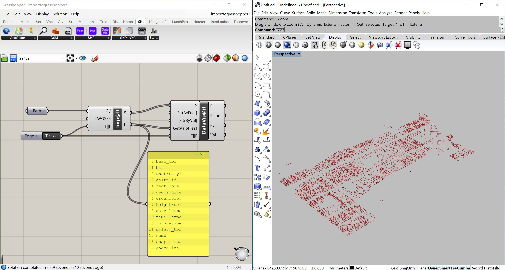
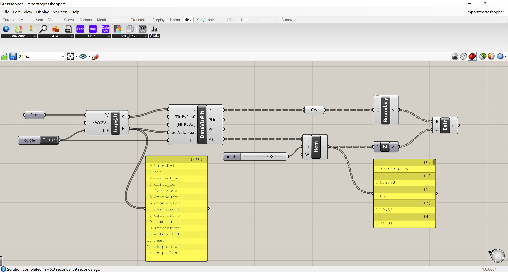

**How to Visualize Spatial Data using Grasshopper**

*This tutorial will cover how to import shapefiles into Rhino using Grasshopper and how to visualize them based on attribute information*

What you will learn:
* How to add shapefiles directly into Rhino using Grasshopper
* How to extract attribute information using fields
* How to extrude features using attribute information

For this tutorial, we will use the [@it](https://www.food4rhino.com/app/it) plugin for Grasshopper. The dataset is this [Buildings in Morningside Heights]() file.  
1. Download the plugin and copy the files into Grasshopper's components folder. Make sure to 'unblock' the .dll file if it still doesn't show up in Grasshopper. 
2. Open Rhino and then go into Grasshopper. 
3. Select the `Imp@it` component and connect `File Path` to C:/ and a `Boolean Toggle` to the `True/False (T||F)` input. Set the file path to the building .shp shapefile and toggle the boolean to true. 
4. Add in the `DataVis@it`component, connecting the `Shapes (S)` output from `Imp@It` to it and the `Features (F)` output from `Imp@It` to `GetValueofFeature (GetValofFeat)`. Lastly, connect the `Boolean Toggle` to the True/False input, still set to true.
At this point, you should see the buildings in the Rhino viewport.
5. Connect a panel to the `F` output from `Imp@It`to view the fields present in the shapefile. Notice that there is an index beside these fields.

Next, we are going to make the buildings 3D by selecting the field with building heights and extruding each building to its corresponding height.

6. Create a `Curve (crv)` component and connect the `Polygon (p)` output from `DataVis@it` to it. 
7. Then make a `Boundary Surface` and connect the `crv` to it. This simplifies the geometries. 
8. Make a `List Item (Item)` to retrieve a specific field from all the fields. Connect the `AttValues (Val)` output from `DataVis@it` to the `List` input. 
9. Make a `Number Slider` with a value of 7, which corresponds to the heightroof field index number and use this as the input for `Index (i)`. Connect a `panel` to the output and look at the results. 
10. Next, connect the `i` output to a `Unit Z` component to set the building heights as the Z value for the extrusion. 
11. Finally, make an `Extrude` component and connect the `Boundary Surface` output to `Base (B)` and the `Unit Z` output to `Direction (D)`.  

The buildings should now have their heights extruded. If the buildings look unnaturally high, change the coordinate system to one with linear units (a projected coordinate system).

12. Bake the extruded geometries to keep them in Rhino by right-clicking on `Extrude` and selecting `Bake`.

