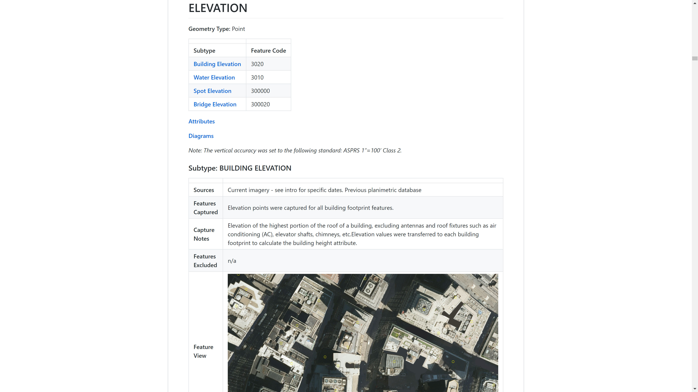
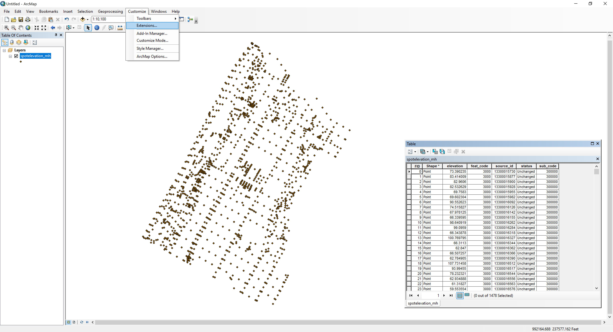
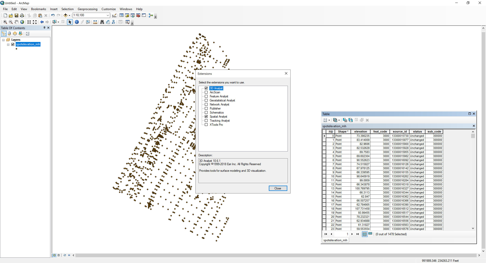
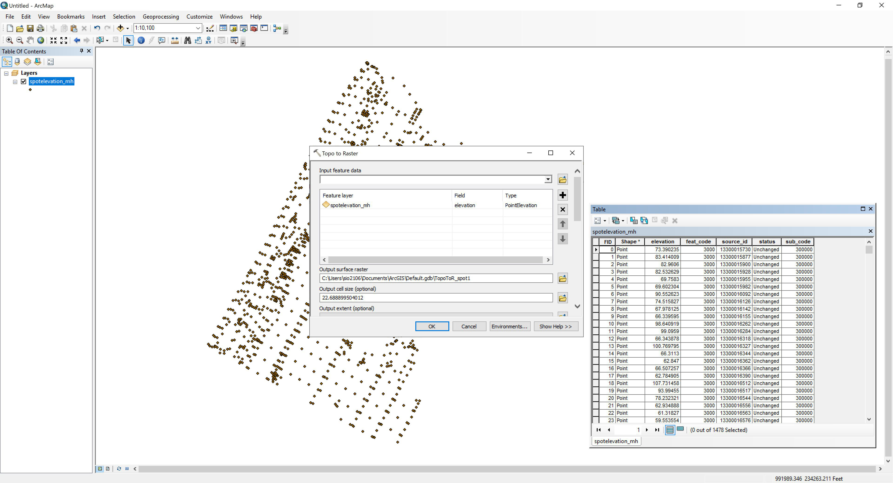
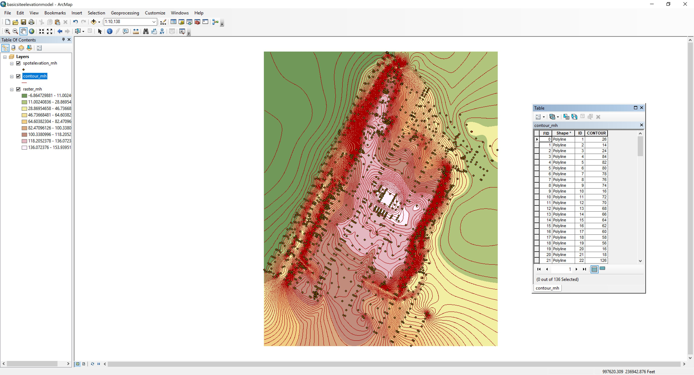
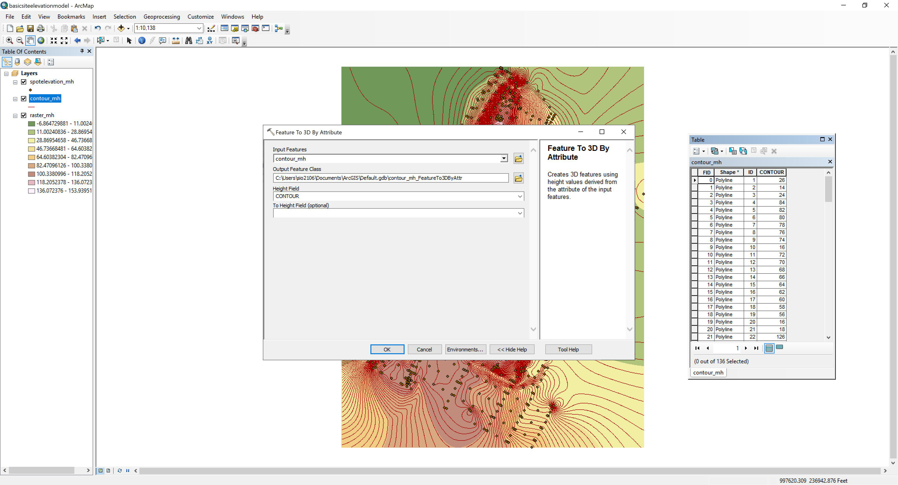
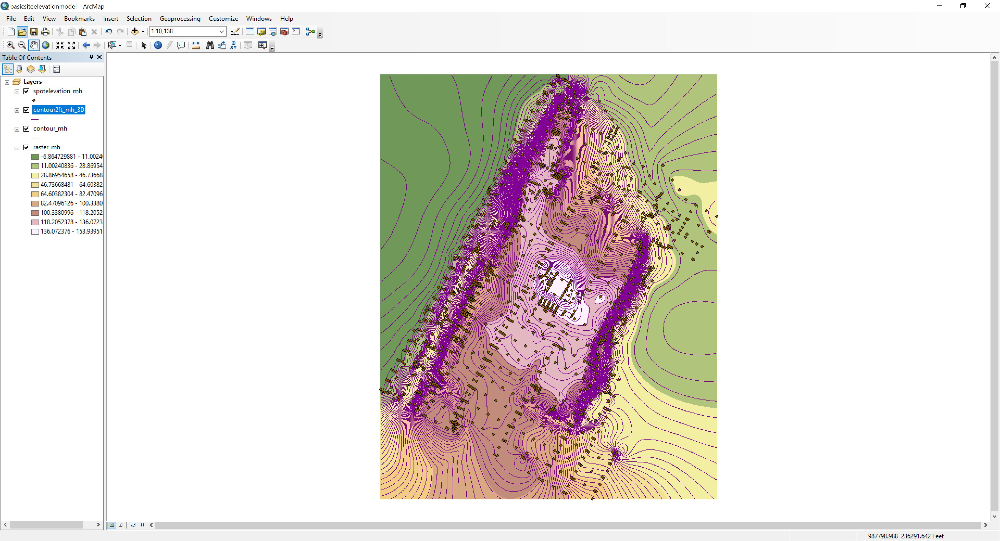

**How to Make a Basic 3D Elevation Model from Elevation Points or Contour Lines**

*This tutorial will cover the creation of a site elevation model from existing elevation points or contour lines*

What you will learn:
* How to work with elevation points, contour lines and raster elevation data
* How to generate rasters from elevation points
* How to generate contour lines at specified intervals from rasters 
* How to generate 3D contour lines 

Elevation models can be made from either elevation points or contour lines, which can then be exported to CAD. These can then be imported into Rhino as 3D lines and surfaces, and used to create physical models. 

The Morningside Heights spot elevation points dataset is available [here](data/spotelevation_mh.zip). 
The original dataset for this tutorial is the [NYC Elevation Points](https://data.cityofnewyork.us/Transportation/Elevation-points/szwg-xci6), but it has been clipped to the Morningside Heights boundary and cleaned to contain only spot elevations using `Select by Attributes`. It is always good practice to look into the metadata or data dictionary for datasets where available. The [documentation](https://github.com/CityOfNewYork/nyc-planimetrics/blob/master/Capture_Rules.md#elevation) for this dataset shows that there are multiple types of elevation points, but as we are dealing with the site's topography only need the `Spot Elevation`. 

1. Open ArcMap and create a Blank map. 
2. Add in the `Morningside Heights Spot Elevation Points` dataset. 
3. Take a look at the attribute table by right-clicking on the layer name and selecting `Open Attribute Table` to see the fields there, including `elevation`, which contains the elevation values on the Z axis. 

4. Next, turn on the `3D Analyst` and `Spatial Analyst` by going to `Customize` > `Extensions` and checking both options. Click `Close`.

Now we are going to create a raster from these elevation points.
5. Open the `ArcToolbox` Panel and navigate to `Spatial Analyst` > `Interpolation` > `Topo to Raster`. Double-click to open the command. You can also search for `Topo to Raster`. 

6. Select the elevation points file in the `Input Feature Data` pull-down and it should then show up in the panel below. 
7. Change the `Field` to `elevation`. Change the `Type` to `PointElevation`. 
8. Choose a destination for the output raster file under `Output Surface Raster`. 
The value of `Output Cell Size` determines the resolution of the raster file and is set by default (reduce the value for a higher resolution output, but this will come at the expense of speed). 
9. Set `Primary Type of Input Data` to `SPOT`. 
The other options can be left as-is. 
10. Change the default location the file is being saved in by clicking on the folder icon beside `Output Surface Raster`. 
11. Scroll down and switch the `Primary Type of Input Data` from `Contour` to `SPOT`. Hit `OK` to create the raster. 

The output raster file should be added automatically to the layers of the current map.

This raster can then be used to create contour lines at specified intervals. The unit will be feet as the current coordinate system's linear unit is US feet. 
12. Confirm this under the `Coordinate System` tab in `Data Frame Properties`. 

13. Open the `ArcToolbox` Panel and navigate to `3D Analyst` > `Raster Surface` > `Contour`. Double-click to open the command. You can also search for `Contour`. 

14. In the contour panel, select the elevation raster file in the `Input Raster` field. 
15. Set the destination for the output contour polylines in the `Output Polyline Features` field. 
It’s good practice to include the contour interval in the file name for easy reference (e.g. `mh_contours_2ft.shp`). 
16. Set the contour interval in `Contour Interval` field. Smaller intervals will take longer to compute. 
17. The Z factor remains 1 because we are not doing any meter-feet conversion or vice versa. 
18. Hit OK to generate the contours, which should automatically be added to the current map.
If you are working with a file in meters and need to generate contours in feet or vice versa, use the `Z Factor` field to enter the conversion factor. When going from meters to feet, the set the value to `0.3048`. For feet to meters conversion, set the factor to `3.2808`. Otherwise, leave the `Z Factor` value at it’s default of `1.0`. The `Show Help` button is a good resource here. 

The output contour polylines are 2D Geometry, with their elevation value contained in the `CONTOUR` field of their Attribute Table.

These contour lines can be converted to 3D Geometry (setting each contour to a corresponding height in the Z-axis) using the `Feature to 3D by Attribute` command. 
19. Open the `ArcToolbox` Panel and navigate to `3D Analyst` > `3D Features` > `Feature to 3D by Attribute`. 
This is useful to do if you plan on using these contour lines in another program such as Rhino. 

20. In the panel, select the 2D contour lines under the `Input Features` field, and select a destination for the 3D contours under the `Output Feature Class` field. 
It is good practice to include “3d” in the file name for reference). 
21. Set the `Height Field` to the `CONTOUR` attribute, and hit `OK`.

The output contours should automatically be added to the current map. They will appear identical to the 2D contours in ArcMap, but if you export them to CAD and open in Rhino or AutoCAD, they will be placed correctly on the Z-axis i.e. they will be 3D.

